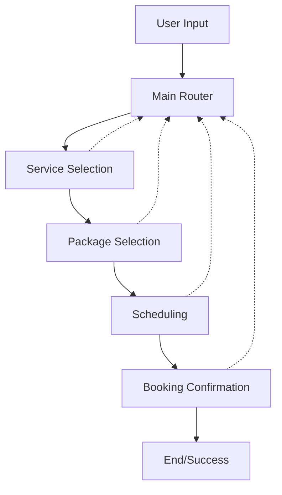

# Salon Booking System Workflow Architecture

## Overview
This document outlines the architecture for a multi-agent salon booking system using LangGraph. The system enables users to select services, packages, and schedule appointments through a structured, conversational flow.

## System Architecture

### Graph Structure
The system uses a directed graph with specialized agents handling different aspects of the booking process. Each agent maintains its own state while contributing to the overall booking flow.

### Agent Components

#### 1. Main Router Agent (Supervisor)
**Responsibilities:**
- Routes conversations to specialized agents
- Maintains global context across booking flow
- Handles fallbacks and error cases
- Manages transitions between booking stages

#### 2. Service Selection Agent
**Responsibilities:**
- Presents available salon services
- Handles service-related questions
- Validates service selections
- Stores selected service in state
- Provides service descriptions and pricing

#### 3. Package Selection Agent
**Responsibilities:**
- Shows packages for selected service
- Explains package differences and benefits
- Handles package-related questions
- Validates package selections
- Stores selected package in state

#### 4. Scheduling Agent
**Responsibilities:**
- Checks service/package availability
- Handles date and time selection
- Manages calendar conflicts
- Validates time slot availability
- Stores selected time slot in state
- Handles timezone considerations

#### 5. Booking Confirmation Agent
**Responsibilities:**
- Summarizes booking details
- Handles final confirmation
- Processes the booking
- Sends confirmation details
- Manages payment integration (if required)

## State Management

### Session State
- User identification
- Current booking stage
- Selected service
- Selected package
- Selected date/time
- Temporary holds on time slots

### Progress Tracking
- Current stage in booking flow
- Completed steps
- Required information
- Validation status

## Error Handling & Fallbacks

### Types of Errors
1. Invalid Selections
   - Non-existent services
   - Unavailable packages
   - Invalid time slots

2. Availability Issues
   - Fully booked time slots
   - Service provider unavailability
   - Holiday conflicts

3. User Input Issues
   - Incomplete information
   - Ambiguous requests
   - Invalid data formats

### Recovery Strategies
- Graceful error messages
- Alternative suggestions
- Clear correction paths
- Session persistence
- Automatic timeout handling

## User Experience Considerations

### Navigation
- Back/forward navigation
- Step modification
- Progress indicators
- Clear option presentation

### Interaction Patterns
- Natural language understanding
- Quick replies for common choices
- Clear confirmation steps
- Help prompts at each stage

### Flexibility
- Multiple entry points
- Context preservation
- Interruption handling
- Multi-session support

## Implementation Guidelines

### Agent Development
1. Use LangGraph's state management
2. Implement clear agent boundaries
3. Define precise routing rules
4. Handle edge cases explicitly

### Integration Points
1. Calendar system
2. Payment processing
3. Notification system
4. User management
5. Service catalog

### Testing Strategy
1. Unit tests for each agent
2. Integration tests for flows
3. End-to-end booking scenarios
4. Error case validation

## Future Enhancements
- Multiple service booking
- Recurring appointments
- Waitlist management
- Staff preferences
- Dynamic pricing
- Customer loyalty integration

## Security Considerations
- User data protection
- Session management
- Booking validation
- Rate limiting
- Audit logging

## Performance Optimization
- Response time targets
- State caching
- Concurrent booking handling
- Resource management
- Database optimization

## Monitoring and Analytics
- User flow tracking
- Conversion metrics
- Error rate monitoring
- Performance metrics
- Usage patterns

This architecture provides a robust foundation for a salon booking system that can be extended and modified as requirements evolve. 