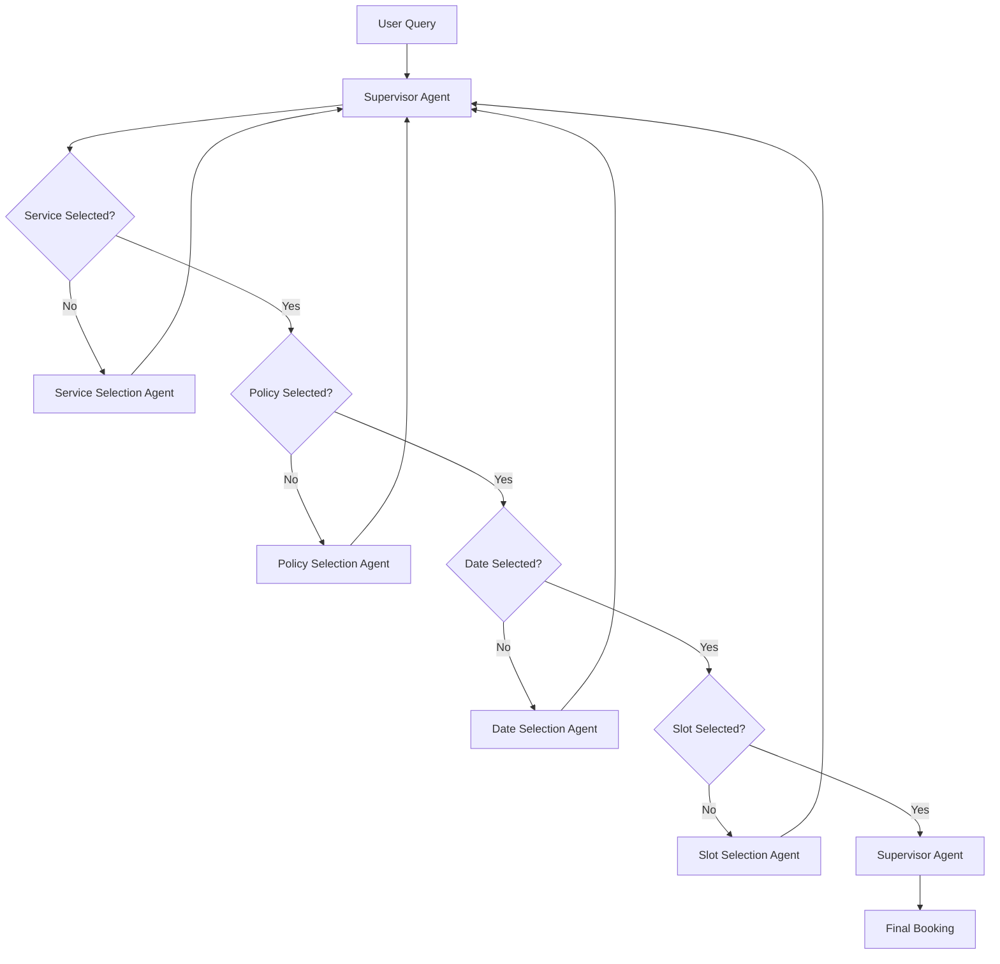

# Salon Booking Workflow Architecture

## Overview
This document outlines the multi-agent architecture for the salon booking system. The system is designed to handle the complete booking workflow from service selection to slot booking using specialized agents coordinated by a supervisor.

## Agent Architecture

### 1. Service Selection Agent
- **Responsibilities**:
  - Present available services from the Service model
  - Handle user queries about services
  - Provide service descriptions and details
  - Transition to Policy Agent once service is selected
- **Data Model**: Uses `Service` model from the database

### 2. Policy Selection Agent
- **Responsibilities**:
  - Show available policies for the selected service
  - Explain policy details, coverage amounts, and premiums
  - Handle policy-related queries
  - Transition to Date Selection Agent once policy is chosen
- **Data Model**: Uses `Policy` model from the database

### 3. Date Selection Agent
- **Responsibilities**:
  - Manage date selection logic
  - Check availability
  - Transition to Slot Selection Agent once date is chosen

### 4. Slot Selection Agent
- **Responsibilities**:
  - Show available time slots for the selected date
  - Handle slot booking
  - Manage conflicts and availability

### 5. Supervisor Agent
- **Responsibilities**:
  - Orchestrate conversation flow between agents
  - Maintain conversation context
  - Handle transitions between agents
  - Manage error cases and recovery
  - Store final booking information

## Workflow Diagram

## Benefits
1. **Separation of Concerns**: Each agent handles a specific aspect of the booking process
2. **Maintainability**: Easier to modify or update individual components
3. **Scalability**: Can add new agents for additional features
4. **Error Handling**: Better control over error cases and recovery
5. **Context Management**: Supervisor maintains the overall context

## Implementation Notes
- Each agent should be implemented as a separate class
- The supervisor should maintain a state machine for the booking process
- All agents should communicate through the supervisor
- Error handling and recovery should be implemented at both agent and supervisor levels
- The system should maintain a consistent conversation context throughout the workflow 